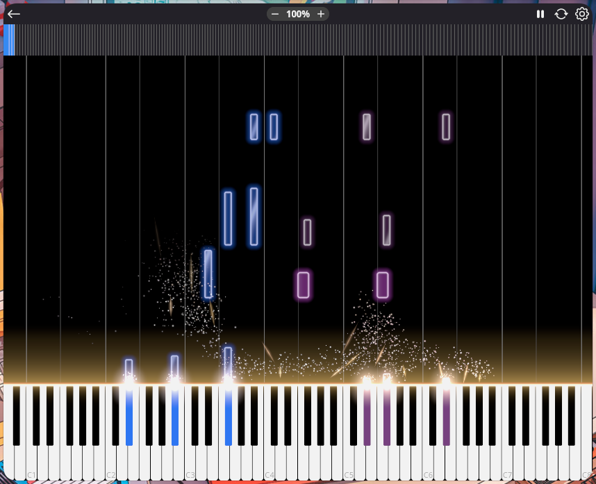

> ## ✨ This fork: Neothesia *juice*
>
> 
>
> A visual-effects pass on Neothesia, living on the [`juice`](https://github.com/bosman-solutions/Neothesia/tree/juice) branch:
>
> - **Gold keyline**: a warm glowing edge across the top of the keyboard.
> - **Flares**: a flat, white-hot bloom wherever a key is struck.
> - **Glitter dust**: fine twinkling motes carried by a curl-noise flow field, so every hit billows into drifting clouds and wisps.
> - **Embers**: slivers that launch lazily, catch the updraft, and whip away.
> - **Glass notes**: falling notes get a smoked translucent body, light streaks, a bright rim, and a soft glow.
> - Effects stay in the lower third of the screen and fade out as they rise.
>
> **Install** (Arch; other distros print the deps they need). Builds from source into `~/.local` as `neothesia-juice`, alongside any stock Neothesia:
>
> ```bash
> curl -fsSL https://raw.githubusercontent.com/bosman-solutions/Neothesia/juice/install.sh | bash
> ```
>
> Rerun to update; `install.sh --uninstall` to remove.
>
> **Tuning**: every effect has knobs at the top of [`neothesia-core/src/render/glow/renderer.rs`](neothesia-core/src/render/glow/renderer.rs). `FX_TEMPO` sets overall speed, `FX_CEILING` sets how high effects reach, and the `DUST_*`, `FLOW_*`, and `STREAK_*` knobs shape the glitter and embers. All FX live in `render/glow/` behind upstream's `GlowRenderer` API, so the fork rebases cleanly onto [upstream](https://github.com/PolyMeilex/Neothesia).
>
> Everything below is upstream's README. All credit for Neothesia itself goes to [PolyMeilex](https://github.com/PolyMeilex) and contributors.

# Neothesia

Neothesia is a cross-platform MIDI visualizer build in Rust.
It helps people to quickly learn how to play piano.
It takes music notes from a MIDI file as an input and displays them as colorful falling blocks on a virtual piano.

Opensource Synthesia was abandoned in favour of [closed source commercial project](https://www.synthesiagame.com/)  
The goal of this project is to bring Opensource Synthesia back to life, and make it look and work as good (or even better) than commercial Synthesia.

If you have any questions, feel free to join my Discord

[](https://discord.gg/sgeZuVA)

## Screenshots


[](https://youtu.be/ReE9nVuMCSE)

|||
|--|--|

[Video](https://youtu.be/ReE9nVuMCSE)

## Download

<a href="https://flathub.org/apps/details/com.github.polymeilex.neothesia"></a>

Arch Linux (**Unofficial AUR** built from source, maintained by @zayn7lie): <https://aur.archlinux.org/packages/neothesia>

All binary releases:
[https://github.com/PolyMeilex/Neothesia/releases](https://github.com/PolyMeilex/Neothesia/releases)

## FAQ

- [FAQ](https://polymeilex.github.io/Neothesia/pages/installation.html)
- [Video encoding](https://polymeilex.github.io/Neothesia/pages/video-encoding.html)

## Thanks to

- [WGPU](https://wgpu.rs/)
- [Linthesia](https://github.com/linthesia/linthesia)
- [Synthesia](https://github.com/johndpope/pianogame)
